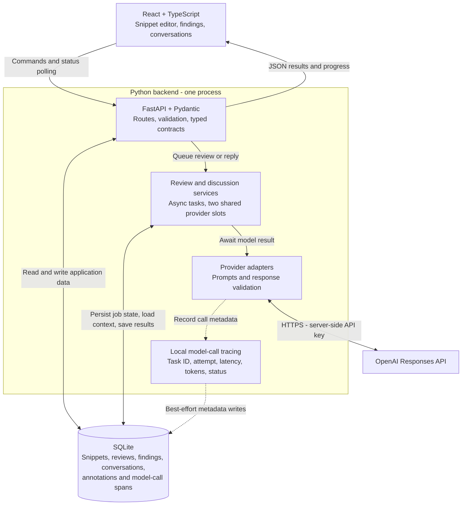

# Code Snippet Reviewer

A local React + Python application that reviews code with OpenAI, tracks individual findings, and supports follow-up conversations. Snippets, reviews, finding resolutions, and conversations persist in SQLite. Submitted code is never executed; accepting a finding records a decision without applying a fix.

## Quick start

Requires Node.js 22.12+, npm, and [uv](https://docs.astral.sh/uv/getting-started/installation/). Python 3.12 is selected by `.python-version`; uv can provision it. Run commands from the repository root.

```sh
npm run setup
# Create configuration only if it does not already exist.
test -f .env || cp .env.example .env
# Edit .env and set OPENAI_API_KEY before requesting reviews or replies.
npm run dev
```

Open **http://127.0.0.1:5173**. The API is at http://127.0.0.1:3001. Snippet management and annotation of existing evaluations work without a key. Startup creates `data/reviewer.db` and applies migrations; no database service is needed. Ctrl+C stops the development processes.

To serve the production build from one Python process, stop the development server first:

```sh
npm run build
npm start
```

Open **http://127.0.0.1:3001**. Keep `migrations/` alongside the project. Run only one backend process per database.

Configuration is in `.env`: `OPENAI_API_KEY`, `OPENAI_MODEL` (default `gpt-4.1-mini`), `REVIEW_TIMEOUT_SECONDS` (60), `PORT` (3001), and `DATABASE_PATH` (`./data/reviewer.db`). Restart the backend after changing it. Keep the default loopback `HOST` for development; the Vite proxy follows `PORT`. Credentials, local databases, dependencies, and build artifacts are excluded from Git.

## Commands

| Command | Purpose |
| --- | --- |
| `npm run setup` | Install Node/Python dependencies from lockfiles |
| `npm run dev` | Start API and frontend with reload |
| `npm run dev:api` / `npm run dev:web` | Start each development process separately |
| `npm run build` / `npm start` | Build the frontend / serve the built app and API |
| `npm run check` | Typecheck, production build, and backend tests |
| `npm test` | Backend, provider-adapter, grader, and tracing tests |
| `npm run test:e2e` | Build and run browser workflows with mocked providers |
| `npm run typecheck` / `npm run format` | Check TypeScript / format frontend sources and browser tests |
| `npm run api:types` | Regenerate TypeScript contracts from FastAPI OpenAPI |
| `npm run db:migrate` | Apply migrations explicitly; also done at startup |
| `npm run trace:calls -- --limit 20` | Inspect local model-call metadata |
| `npm run eval:review -- --live` | Run the ten-case quality evaluation; makes billable calls |

Install Chromium once with `npx playwright install chromium`. E2E tests use a temporary database and their own server on port 3032. If occupied, run `E2E_PORT=3037 npm run test:e2e`.

## Main workflow

1. Create a snippet with a title, language, and code, or use an example. Browse/filter the dashboard by language and latest review status.
2. Choose **Review snippet** and inspect structured findings beside highlighted source. Line references select the affected code. Empty findings are a valid successful review.
3. **Accept**, **Dismiss**, or **Reopen** a finding independently of the review's execution status. **Review history** restores earlier results and their resolutions.
4. **Discuss with AI** supports follow-up questions. **New conversation** starts a separate history for the same finding; **Conversation** switches histories. Each reply receives the snippet, finding, and up to ten successful exchanges from that conversation.
5. A lost review response offers **Check submission**, reusing the same persisted request UUID even after completion or same-tab reload. **Run new review** / **Retry review** starts a deliberately new run after confirmation. Clearing browser storage removes the recovery identity. Discussion and conversation creation also support submission recovery.

## Model selection

The app default remains **GPT-4.1 mini** (`OPENAI_MODEL`). **Model for next review** and **Model for next reply** offer GPT-5.6 Sol, GPT-5.5, GPT-4.1 mini, GPT-4.1, and GPT-4.1 nano. A configured OpenAI model/snapshot is also included as the app default. Choices come from a server-owned catalog; they are not a live list of models enabled for your API account.

Selecting a model remembers it as the default for new requests in this browser. Each queued review/reply stores its model and uses a dedicated adapter configuration, so simultaneous requests cannot overwrite each other's model. Historical results display their recorded model. Lost-response recovery and reply retries retain the original model; a new review/question can use a different one. Older results without trace evidence display an unknown model rather than guessing.

GPT-5.5 and GPT-5.6 Sol explicitly use `reasoning.effort=none` as the latency baseline, with the existing output caps (5,000 tokens for reviews; 1,500 for replies). Compare reasoning-enabled configurations on the eval dataset before changing this policy. Other operator-configured models retain provider defaults.

All choices use the server's OpenAI key. Model access, cost, and behavior depend on the account/model; a rejected call produces an explicit failure, with no silent fallback. The existing quality measurements apply only to GPT-4.1 mini. Official OpenAI compatibility references: [GPT-5.5](https://developers.openai.com/api/docs/models/gpt-5.5), [GPT-5.6 Sol](https://developers.openai.com/api/docs/models/gpt-5.6-sol), [GPT-4.1 mini](https://developers.openai.com/api/docs/models/gpt-4.1-mini), [GPT-4.1](https://developers.openai.com/api/docs/models/gpt-4.1), [GPT-4.1 nano](https://developers.openai.com/api/docs/models/gpt-4.1-nano).

## Architecture



Review and discussion services persist a queued job before scheduling model work; the browser polls for completion. Findings and successful review status are saved in one transaction. Tracing records metadata separately from job state, so a trace-write failure does not fail a valid review.

In development, Vite serves the frontend and proxies `/api` to FastAPI. With `npm start`, FastAPI also serves the built frontend. The browser never calls OpenAI directly.

## Design and limits

FastAPI/Pydantic owns the contracts; generated TypeScript types keep the React client aligned. SQLite stores domain records and transactional migrations. In-process asynchronous jobs share two provider slots, with one active review per snippet and one active reply per finding. Timeout includes queue wait. Restart marks interrupted work failed for explicit retry; this is not a durable multi-worker job system or an exactly-once provider guarantee.

Code is immutable. Model output is validated for schema and line bounds; findings and successful completion are committed atomically. Model suggestions remain fallible. No authentication, snippet editing, automatic patch application, streaming, or tool execution is implemented.

Read the concise [design](docs/design.md) and [API/data reference](docs/data-contract.md).

## Tests, evaluation, and observability

Latest software verification: **90 backend tests and 30 Chromium browser cases** (15 scenarios at desktop and narrow widths), plus TypeScript and production build. Coverage includes persistence, filters, review/finding lifecycle, conversation isolation, retries, lost responses, database constraints/migrations, human annotations/export, tracing, and grading. The complete [test inventory and verification limits](docs/verification.md) distinguish automated checks, manual acceptance, and earlier live-provider checks. Tests use temporary databases and mocked providers, without API cost.

Model quality is evaluated separately: ten synthetic development cases, versioned prompts, saved results, and a human annotation/export workflow. These cases were used for tuning; they are not an independent accuracy benchmark. The selected prompt still has a documented SQL false positive. See the [quality guide](docs/quality.md).

Model-call tracing is implemented in SQLite; basic access/error logging goes to the server console. There is no distributed trace tree or centralized structured logging yet. See [tracing and logging](docs/quality.md#local-model-call-tracing) for fields, commands, and limitations.

## Prioritized extensions

1. Independently labeled held-out cases and stronger semantic/fix-quality evaluation.
2. Correlated structured logs and nested workflow traces before adding multi-step agent behavior.
3. Durable jobs, checkpoints, budgets, and tool permissions when workflows or deployment require them.
4. Authentication/data ownership before shared hosting; snippet revisions before edits or proposed patches.

These are future work, not implemented features. See the [roadmap and extension points](docs/roadmap.md) for scope and prerequisites.

[Short demo](docs/verification.md#short-demo) · [AI usage log: five examples](AI_USAGE.md) · [Implementation milestones](docs/execution-plan.md)
